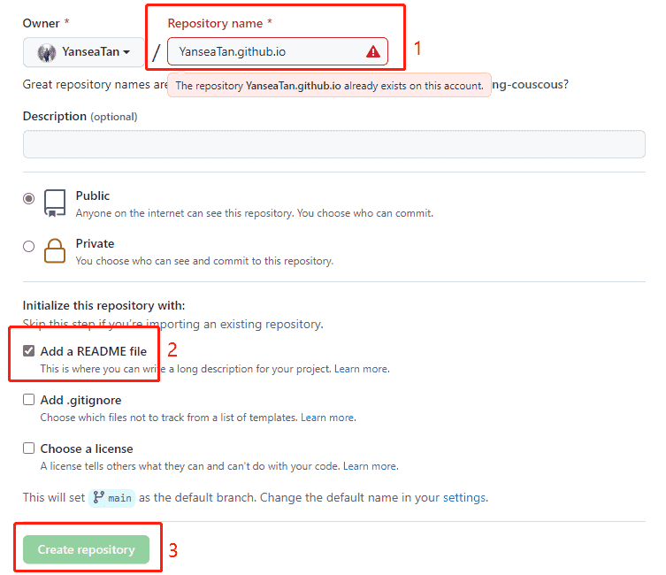
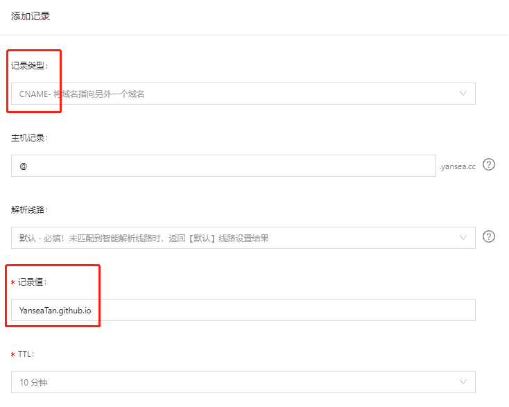
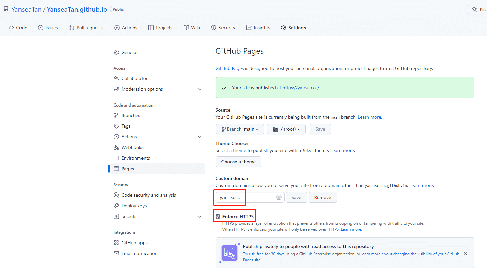

# GitHub Pages 搭建过程

*Article copied from [sspai.com](https://sspai.com/post/54608) on 2022.03.17 by [YanseaTan](https://yansea.cc)*

- [GitHub Pages 搭建过程](#github-pages-搭建过程)
  - [为什么使用 GitHub Pages](#为什么使用-github-pages)
  - [如何使用 GitHub Pages](#如何使用-github-pages)
    - [基本页面的生成](#基本页面的生成)
    - [配置自定义域名并免费使用 HTTPS](#配置自定义域名并免费使用-https)

## 为什么使用 GitHub Pages

如果你把他作为一个轻量级的个人博客服务，GitHub Pages 相较 WordPress 之类的建站服务有什么优势呢？

- 首先他是完全免费的，相较其他的同类产品，他能替你省下一笔服务费，节约下的钱可以让你买一些其他的会员服务；
- 无须自己购买云服务进行搭建，只需按步骤一步步操作即可，即使你不懂他的技术细节；
- 支持的功能多，玩法丰富，你可以绑定你的域名、使用免费的 HTTPS、自己 DIY 网站的主题、使用他人开发好的插件等等；
- 当完成搭建后，你只需要专注于文章创作就可以了，其他诸如环境搭建、系统维护、文件存储的事情一概不用操心，都由 GitHub 处理。

当然了，作为一款免费的服务，我们也是要遵守 GitHub 官方使用建议和限制，在使用的时候项目和网站的大小不要超过 1GB，也不要过于频繁的更新网站的内容（每小时不超过 10 个版本），每个月的也要注意带宽使用上限为 100GB。

综合来看，GitHub Pages 依旧可以说是中小型博客或项目主页的最佳选项之一。

## 如何使用 GitHub Pages

### 基本页面的生成

首先你需要注册一个 GitHub 账号，并在个人主界面里选择创建一个新的 Repository 。

进入页面后，在 Repository name 的位置填写域名，格式必须是`username.github.io` ,勾选 “Add a README file” ，然后创建仓库。

至此，一个只有标题的基本页面已经生成完毕，待 GitHub Pages 部署完毕后，就可以通过`username.github.io`来访问你自己的网页了。

你可以修改仓库中的 “README.md” 来改变主页面的内容和布局，也可以利用子文件夹通过链接的方式来创建二级页面。这是此网站的仓库链接以供参考 -> [YanseaTan.github.io](YanseaTan.github.io)

*ps：GitHub官方也提供了一些默认网站主题，通过仓库界面的 "Settings -> Pages -> Choose a theme" ；来进行选择。*

### 配置自定义域名并免费使用 HTTPS

如果觉得`username.github.io`的域名不够酷，GitHub Pages 还支持自定义的域名。

在 2018 年 5 月 1 日之后，GitHub Pages 已经开始提供免费为自定义域名开启 HTTPS 的功能，并且大大简化了操作的流程，现在用户已经不再需要自己提供证书，只需要将自己的域名使用 CNAME 的方式指向自己的 GitHub Pages 域名即可。

但是这个前提是需要有自己的域名，以此网站为例，是在[阿里云](https://wanwang.aliyun.com/domain/)注册购买的域名和个人DNS服务。根据提示进行实名认证购买成功后（需要一定时间通过审查），需要在你的 DNS 解析里添加一条解析记录，记录类型选择 CNAME ，记录值指向`username.github.io`，其他选项根据需要选择，然后提交。提交完成后等待 DNS 解析的生效（DNS 的解析记录生效到全球可能需要几分钟时间）。

之后回到仓库的 Settings 界面，找到 Pages 设置，填写我们刚刚建立的子域名，以我自己的`yansea.cc`举例，点击保存，仓库中会自动生成 CNAME 文件，等待解析和部署完成，勾选 “Enforce HTTPS”。

现在再访问 [yansea.cc](yansea.cc) 就会发现，自定义域名和 HTTPS 都生效了！也可以看到网站证书已经颁发下来了。