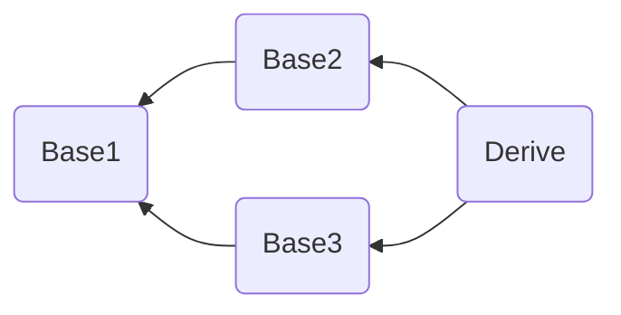
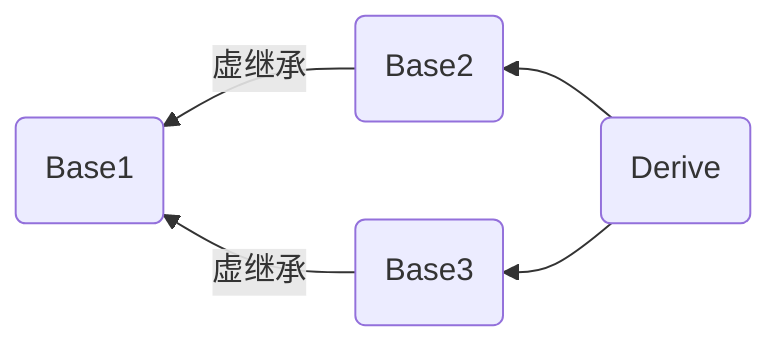

# C++ 知识点整理

*Summarized from [LeetCode](https://leetcode-cn.com/leetbook/detail/cpp-interview-highlights/) on 2022.04.14 by [YanseaTan](https://yansea.cc)*

- [C++ 知识点整理](#c-知识点整理)
  - [编译内存相关](#编译内存相关)
    - [编译过程](#编译过程)
    - [静态链接和动态链接](#静态链接和动态链接)
    - [内存管理](#内存管理)
    - [栈和堆的区别](#栈和堆的区别)
    - [类的大小](#类的大小)
    - [什么是内存泄露](#什么是内存泄露)
    - [怎么防止内存泄漏？](#怎么防止内存泄漏)
    - [智能指针有哪几种？智能指针的实现原理？](#智能指针有哪几种智能指针的实现原理)
  - [语言对比](#语言对比)
    - [C++ 11 新特性](#c-11-新特性)
  - [面向对象](#面向对象)
    - [什么是面向对象？面向对象的三大特性](#什么是面向对象面向对象的三大特性)
    - [重载、重写、隐藏的区别](#重载重写隐藏的区别)
    - [什么是多态？多态如何实现？](#什么是多态多态如何实现)
  - [类相关](#类相关)
    - [纯虚函数](#纯虚函数)
    - [虚函数和纯虚函数的区别](#虚函数和纯虚函数的区别)
    - [虚函数的实现机制](#虚函数的实现机制)
    - [单继承和多继承的虚函数表结构](#单继承和多继承的虚函数表结构)
    - [构造函数、析构函数是否可以定义成虚函数？为什么？](#构造函数析构函数是否可以定义成虚函数为什么)
    - [多重继承时会出现什么状况（菱形继承）？如何解决？](#多重继承时会出现什么状况菱形继承如何解决)
    - [C++ 类对象的初始化顺序](#c-类对象的初始化顺序)
    - [深拷贝和浅拷贝的区别](#深拷贝和浅拷贝的区别)
  - [语言特性相关](#语言特性相关)
    - [什么是指针？指针的大小及用法？](#什么是指针指针的大小及用法)
    - [什么是野指针和悬空指针？](#什么是野指针和悬空指针)
    - [指针和引用的区别？](#指针和引用的区别)

## 编译内存相关

### 编译过程

编译（编译预处理、编译、优化），汇编，链接。

### 静态链接和动态链接

静态链接：代码从其所在的静态链接库中拷贝到最终的可执行程序中，在该程序被执行时，这些代码会被装入到该进程的虚拟地址空间中。

缺点是**浪费空间**，每个可执行程序都会有目标文件的一个副本，这样如果目标文件进行了更新操作，就需要重新进行编译链接生成可执行程序**（更新困难）**；优点就是执行的时候运行速度快，因为可执行程序具备了程序运行的所有内容。

动态链接：代码被放到动态链接库或共享对象的某个目标文件中，链接程序只是在最终的可执行程序中记录了共享对象的名字等一些信息。在程序执行时，动态链接库的全部内容会被映射到运行时相应进行的虚拟地址的空间。

节省内存、更新方便，但是动态链接是在程序运行时，每次执行都需要链接，相比静态链接会有一定的性能损失。

### 内存管理

C++ 内存分区：栈、堆、全局/静态存储区、常量存储区、代码区。

1. 栈：存放函数的局部变量、函数参数、返回地址等，由编译器自动分配和释放。
2. 堆：动态申请的内存空间，就是由 malloc 分配的内存块，由程序员控制它的分配和释放，如果程序执行结束还没有释放，操作系统会自动回收。
3. 全局区/静态存储区（.bss 段和 .data 段）：存放全局变量和静态变量，程序运行结束操作系统自动释放，在 C 语言中，未初始化的放在 .bss 段中，初始化的放在 .data 段中，C++ 中不再区分了。
4. 常量存储区（.data 段）：存放的是常量，不允许修改，程序运行结束自动释放。
5. 代码区（.text 段）：存放代码，不允许修改，但可以执行。编译后的二进制文件存放在这里。

### 栈和堆的区别

1. 申请方式：栈是系统自动分配，堆是程序员主动申请。

2. 申请后系统响应：分配栈空间，如果剩余空间大于申请空间则分配成功，否则分配失败栈溢出；申请堆空间，堆在内存中呈现的方式类似于链表（记录空闲地址空间的链表），在链表上寻找第一个大于申请空间的节点分配给程序，将该节点从链表中删除，大多数系统中该块空间的首地址存放的是本次分配空间的大小，便于释放，将该块空间上的剩余空间再次连接在空闲链表上。

3. 栈在内存中是连续的一块空间（向低地址扩展）最大容量是系统预定好的，堆在内存中的空间（向高地址扩展）是不连续的。

4. 申请效率：栈是有系统自动分配，申请效率高，但程序员无法控制；堆是由程序员主动申请，效率低，使用起来方便但是容易产生碎片。

5. 存放的内容：栈中存放的是局部变量，函数的参数；堆中存放的内容由程序员控制。

### 类的大小

- 遵循结构体的对齐原则。
- 与普通成员变量有关，与成员函数和静态成员无关。即普通成员函数，静态成员函数，静态数据成员，静态常量数据成员均对类的大小无影响。因为静态数据成员被类的对象共享，并不属于哪个具体的对象。
- 虚函数对类的大小有影响，是因为虚函数表指针的影响。（32位系统指针占用4字节，64位系统占用8字节）
- 虚继承对类的大小有影响，是因为虚基表指针带来的影响。
- 空类的大小是一个特殊情况，空类的大小为 1，当用 new 来创建一个空类的对象时，为了保证不同对象的地址不同，空类也占用存储空间。

### 什么是内存泄露

内存泄漏：由于疏忽或错误导致的程序未能释放已经不再使用的内存。

- 并非指内存从物理上消失，而是指程序在运行过程中，由于疏忽或错误而失去了对该内存的控制，从而造成了内存的浪费。
- 常指堆内存泄漏，因为堆是动态分配的，而且是用户来控制的，如果使用不当，会产生内存泄漏。
- 使用 malloc、calloc、realloc、new 等分配内存时，使用完后要调用相应的 free 或 delete 释放内存，否则这块内存就会造成内存泄漏。
- 指针重新赋值
  ```c++
  char *p = (char *)malloc(10);
  char *p1 = (char *)malloc(10);
  p = np;
  ```
  开始时，指针 p 和 p1 分别指向一块内存空间，但指针 p 被重新赋值，导致 p 初始时指向的那块内存空间无法找到，从而发生了内存泄漏。

### 怎么防止内存泄漏？

1. 内部封装：将内存的分配和释放封装到类中，在构造的时候申请内存，析构的时候释放内存。
2. 智能指针：智能指针是 C++ 中已经对内存泄漏封装好了一个工具，可以直接拿来使用，将在下一个问题中对智能指针进行详细的解释。

### 智能指针有哪几种？智能指针的实现原理？

智能指针是为了解决动态内存分配时带来的内存泄漏以及多次释放同一块内存空间而提出的。C++11 中封装在了 <memory> 头文件中。

C++11 中智能指针包括以下三种：

- **共享指针（shared_ptr）**：资源可以被多个指针共享，使用计数机制表明资源被几个指针共享。通过 use_count() 查看资源的所有者的个数，可以通过 unique_ptr、weak_ptr 来构造，调用 release() 释放资源的所有权，计数减一，当计数减为 0 时，会自动释放内存空间，从而避免了内存泄漏。
- **独占指针（unique_ptr）**：独享所有权的智能指针，资源只能被一个指针占有，该指针不能拷贝构造和赋值。但可以进行移动构造和移动赋值构造（调用 move() 函数），即一个 unique_ptr 对象赋值给另一个 unique_ptr 对象，可以通过该方法进行赋值。
- **弱指针（weak_ptr）**：指向 share_ptr 指向的对象，能够解决由shared_ptr带来的循环引用问题。

## 语言对比

### C++ 11 新特性

1. auto 类型推导

auto 关键字：自动类型推导，编译器会在**编译期间**通过初始值推导出变量的类型，通过 auto 定义的变量必须有初始值。

```c++
auto var = val1 + val2; // 根据 val1 和 val2 相加的结果推断出 var 的类型
```

2. decltype 类型推导

decltype 关键字：decltype 是“declare type”的缩写，译为“声明类型”。和 auto 的功能一样，都用来在编译时期进行自动类型推导。如果希望从表达式中推断出要定义的变量的类型，但是不想用该表达式的值初始化变量，这时就不能再用 auto。decltype 作用是选择并返回操作数的数据类型。

```c++
auto var = val1 + val2; 
decltype(val1 + val2) var1 = 0; 
```

区别：

- auto 根据 = 右边的初始值 val1 + val2 推导出变量的类型，并将该初始值赋值给变量 var；decltype 根据 val1 + val2 表达式推导出变量的类型，变量的初始值和与表达式的值无关。
- auto 要求变量必须初始化，因为它是根据初始化的值推导出变量的类型，而 decltype 不要求，定义变量的时候可初始化也可以不初始化。

3. lambda 表达式

lambda 表达式，又被称为 lambda 函数或者 lambda 匿名函数。

lambda 匿名函数的定义：

```c++
[capture list] (parameter list) -> return type
{
   function body;
};
```

其中：

- capture list：捕获列表，指 lambda 所在函数中定义的局部变量的列表，通常为空。
- return type、parameter list、function body：分别表示返回值类型、参数列表、函数体，和普通函数一样。

4. 范围 for 语句

语法格式：

```c++
for (declaration : expression){
    statement
}
```

- expression：必须是一个序列，例如用花括号括起来的初始值列表、数组、vector ，string 等，这些类型的共同特点是拥有能返回迭代器的 beign、end 成员。
- declaration：此处定义一个变量，序列中的每一个元素都能转化成该变量的类型，常用 auto 类型说明符。

5. 右值引用

右值引用：绑定到右值的引用，用 && 来获得右值引用，右值引用只能绑定到要销毁的对象。为了和右值引用区分开，常规的引用称为左值引用。

举例：

```c++
#include <iostream>
#include <vector>
using namespace std;
int main()
{
    int var = 42;
    int &l_var = var;
    int &&r_var = var; // error: cannot bind rvalue reference of type 'int&&' to lvalue of type 'int' 错误：不能将右值引用绑定到左值上

    int &&r_var2 = var + 40; // 正确：将 r_var2 绑定到求和结果上
    return 0;
}
```

- 左值引用的对象是变量
- 右值引用的对象是常量

6. 标准库 move() 函数

move() 函数：通过该函数可获得绑定到左值上的右值引用，该函数包括在 utility 头文件中。

7. 智能指针

8. delete 函数和 default 函数

- delete 函数：= delete 表示该函数不能被调用。
- default 函数：= default 表示编译器生成默认的函数，例如：生成默认的构造函数。

```c++
#include <iostream>
using namespace std;

class A
{
public:
	A() = default; // 表示使用默认的构造函数
	~A() = default;	// 表示使用默认的析构函数
	A(const A &) = delete; // 表示类的对象禁止拷贝构造
	A &operator=(const A &) = delete; // 表示类的对象禁止拷贝赋值
};
int main()
{
	A ex1;
	A ex2 = ex1; // error: use of deleted function 'A::A(const A&)'
	A ex3;
	ex3 = ex1; // error: use of deleted function 'A& A::operator=(const A&)'
	return 0;
}
```

## 面向对象

### 什么是面向对象？面向对象的三大特性

面向对象：对象是指具体的某一个事物，这些事物的抽象就是类，类中包含数据（成员变量）和动作（成员方法）。

面向对象的三大特性：

1. 封装：将具体的实现过程和数据封装成一个函数，只能通过接口进行访问，降低耦合性。
2. 继承：子类继承父类的特征和行为，子类有父类的非 private 方法或成员变量，子类可以对父类的方法进行重写，增强了类之间的耦合性，但是当父类中的成员变量、成员函数或者类本身被 final 关键字修饰时，修饰的类不能继承，修饰的成员不能重写或修改。
3. 多态：多态就是不同继承类的对象，对同一消息做出不同的响应，基类的指针指向或绑定到派生类的对象，使得基类指针呈现不同的表现方式。

### 重载、重写、隐藏的区别

1. 重载：是指同一可访问区内被声明几个具有不同参数列（参数的类型、个数、顺序）的同名函数，根据参数列表确定调用哪个函数，重载不关心函数返回类型。

```c++
class A
{
public:
    void fun(int tmp);
    void fun(float tmp);        // 重载 参数类型不同（相对于上一个函数）
    void fun(int tmp, float tmp1); // 重载 参数个数不同（相对于上一个函数）
    void fun(float tmp, int tmp1); // 重载 参数顺序不同（相对于上一个函数）
    int fun(int tmp);            // error: 'int A::fun(int)' cannot be overloaded 错误：注意重载不关心函数返回类型
};
```

2. 隐藏：是指派生类的函数屏蔽了与其同名的基类函数，主要只要同名函数，不管参数列表是否相同，基类函数都会被隐藏。

```c++
#include <iostream>
using namespace std;

class Base
{
public:
    void fun(int tmp, float tmp1) { cout << "Base::fun(int tmp, float tmp1)" << endl; }
};

class Derive : public Base
{
public:
    void fun(int tmp) { cout << "Derive::fun(int tmp)" << endl; } // 隐藏基类中的同名函数
};

int main()
{
    Derive ex;
    ex.fun(1);       // Derive::fun(int tmp)
    ex.fun(1, 0.01); // error: candidate expects 1 argument, 2 provided
    return 0;
}
```

说明：上述代码中 ex.fun(1, 0.01); 出现错误，说明派生类中将基类的同名函数隐藏了。若是想调用基类中的同名函数，可以加上类型名指明 ex.Base::fun(1, 0.01);，这样就可以调用基类中的同名函数。

3. 重写(覆盖)：是指派生类中存在重新定义的函数。函数名、参数列表、返回值类型都必须同基类中被重写的函数一致，只有函数体不同。派生类调用时会调用派生类的重写函数，不会调用被重写函数。重写的基类中被重写的函数必须有 virtual 修饰。

```c++
#include <iostream>
using namespace std;

class Base
{
public:
    virtual void fun(int tmp) { cout << "Base::fun(int tmp) : " << tmp << endl; }
};

class Derived : public Base
{
public:
    virtual void fun(int tmp) { cout << "Derived::fun(int tmp) : " << tmp << endl; } // 重写基类中的 fun 函数
};
int main()
{
    Base *p = new Derived();
    p->fun(3); // Derived::fun(int) : 3
    return 0;
}
```

- **重写和重载的区别：**
  - 范围区别：对于类中函数的重载或者重写而言，重载发生在同一个类的内部，重写发生在不同的类之间（子类和父类之间）。
  - 参数区别：重载的函数需要与原函数有相同的函数名、不同的参数列表，不关注函数的返回值类型；重写的函数的函数名、参数列表和返回值类型都需要和原函数相同，父类中被重写的函数需要有 virtual 修饰。
  - virtual 关键字：重写的函数基类中必须有 virtual关键字的修饰，重载的函数可以有 virtual 关键字的修饰也可以没有。

- **隐藏和重写，重载的区别：**
  - 范围区别：隐藏与重载范围不同，隐藏发生在不同类中。
  - 参数区别：隐藏函数和被隐藏函数参数列表可以相同，也可以不同，但函数名一定相同；当参数不同时，无论基类中的函数是否被 virtual 修饰，基类函数都是被隐藏，而不是重写。

### 什么是多态？多态如何实现？

多态：多态就是不同继承类的对象，对同一消息做出不同的响应，基类的指针指向或绑定到派生类的对象，使得基类指针呈现不同的表现方式。在基类的函数前加上 virtual 关键字，在派生类中重写该函数，运行时将会根据对象的实际类型来调用相应的函数。如果对象类型是派生类，就调用派生类的函数；如果对象类型是基类，就调用基类的函数。

实现方法：多态是通过虚函数实现的，虚函数的地址保存在虚函数表中，虚函数表的地址保存在含有虚函数的类的实例对象的内存空间中。

实现过程：

1. 在类中用 virtual 关键字声明的函数叫做虚函数；
2. 存在虚函数的类都有一个虚函数表，当创建一个该类的对象时，该对象有一个指向虚函数表的虚表指针（虚函数表和类对应的，虚表指针是和对象对应）；
3. 当基类指针指向派生类对象，基类指针调用虚函数时，基类指针指向派生类的虚表指针，由于该虚表指针指向派生类虚函数表，通过遍历虚表，寻找相应的虚函数。

```c++
#include <iostream>
using namespace std;

class Base
{
public:
	virtual void fun() { cout << "Base::fun()" << endl; }
	virtual void fun1() { cout << "Base::fun1()" << endl; }
	virtual void fun2() { cout << "Base::fun2()" << endl; }
};

class Derive : public Base
{
public:
	void fun() { cout << "Derive::fun()" << endl; }
	virtual void D_fun1() { cout << "Derive::D_fun1()" << endl; }
	virtual void D_fun2() { cout << "Derive::D_fun2()" << endl; }
};

int main()
{
	Base *p = new Derive();
	p->fun(); // Derive::fun() 调用派生类中的虚函数
	return 0;
}
```

## 类相关

### 纯虚函数

1. 纯虚函数定义

纯虚函数是在基类中声明的虚函数，它在基类中没有定义，但要求任何派生类都要定义自己的实现方法。在基类中实现纯虚函数的方法是在函数原型后加 “ =0 ”

2. 引入原因

- 为了方便使用多态特性，我们常常需要在基类中定义虚拟函数。
- 在很多情况下，基类本身生成对象是不合情理的。例如，动物作为一个基类可以派生出老虎、孔雀等子类，但动物本身生成对象明显不合常理。

为了解决上述问题，引入了纯虚函数的概念，将函数定义为纯虚函数（方法：virtual ReturnType Function()= 0;），则编译器要求在派生类中必须予以重载以实现多态性。同时含有纯虚拟函数的类称为抽象类，它不能生成对象。这样就很好地解决了上述两个问题。

3. 相似概念

- 多态性
  
  指相同对象收到不同消息或不同对象收到相同消息时产生不同的实现动作。C++支持两种多态性：编译时多态性，运行时多态性。
  - 编译时多态性：通过函数重载和运算符重载来实现的。
  - 运行时多态性：通过继承和虚函数来实现的。

- 虚函数
  
  虚函数是在基类中被声明为virtual，并在派生类中重新定义的成员函数，可实现成员函数的动态重载。纯虚函数的声明有着特殊的语法格式：virtual 返回值类型成员函数名（参数表）=0；

  请注意，纯虚函数应该只有声明，没有具体的定义，即使给出了纯虚函数的定义也会被编译器忽略。

- 抽象类
  
  包含纯虚函数的类称为抽象类。由于抽象类包含了没有定义的纯虚函数，所以不能定义抽象类的对象，类中只有接口，没有具体的实现方法。在C++中，我们可以把只能用于被继承而不能直接创建对象的类设置为抽象类（Abstract Class）。继承纯虚函数的派生类，如果没有完全实现基类纯虚函数，依然是抽象类，不能实例化对象。

  之所以要存在抽象类，最主要是因为它具有不确定因素。我们把那些类中的确存在，但是在父类中无法确定具体实现的成员函数称为纯虚函数。纯虚函数是一种特殊的虚函数，它只有声明，没有具体的定义。抽象类中至少存在一个纯虚函数；存在纯虚函数的类一定是抽象类。存在纯虚函数是成为抽象类的充要条件。

  子类必须继承父类的纯虚函数，并全部实现后，才能创建子类的对象。

### 虚函数和纯虚函数的区别

除定义过程中的区别外，应注意如下两者作用的区别：

- 定义一个函数为虚函数，不代表函数为不被实现的函数。
- 定义他为虚函数是为了允许用基类的指针来调用子类的这个函数。
- 定义一个函数为纯虚函数，才代表函数没有被实现。
- 定义纯虚函数是为了实现一个接口，起到一个规范的作用，规范继承这个类的程序员必须实现这个函数。

### 虚函数的实现机制

实现机制：虚函数通过虚函数表来实现。虚函数的地址保存在虚函数表中，在类的对象所在的内存空间中，保存了指向虚函数表的指针（称为“虚表指针”），通过虚表指针可以找到类对应的虚函数表。虚函数表解决了基类和派生类的继承问题和类中成员函数的覆盖问题，当用基类的指针来操作一个派生类的时候，这张虚函数表就指明了实际应该调用的函数。

虚函数表相关知识点：

- 虚函数表存放的内容：类的虚函数的地址。
- 虚函数表建立的时间：编译阶段，即程序的编译过程中会将虚函数的地址放在虚函数表中。
- 虚表指针保存的位置：虚表指针存放在对象的内存空间中最前面的位置，这是为了保证正确取到虚函数的偏移量。

应注意：虚函数表和类绑定，虚表指针和对象绑定。即类的不同的对象的虚函数表是一样的，但是每个对象都有自己的虚表指针，来指向类的虚函数表。

实例，无虚函数覆盖的情况：

```c++
#include <iostream>
using namespace std;

class Base
{
public:
    virtual void B_fun1() { cout << "Base::B_fun1()" << endl; }
    virtual void B_fun2() { cout << "Base::B_fun2()" << endl; }
    virtual void B_fun3() { cout << "Base::B_fun3()" << endl; }
};

class Derive : public Base
{
public:
    virtual void D_fun1() { cout << "Derive::D_fun1()" << endl; }
    virtual void D_fun2() { cout << "Derive::D_fun2()" << endl; }
    virtual void D_fun3() { cout << "Derive::D_fun3()" << endl; }
};
int main()
{
    Base *p = new Derive();
    p->B_fun1(); // Base::B_fun1()
    return 0;
}
```

### 单继承和多继承的虚函数表结构

**编译器处理虚函数表：**

- 编译器将虚函数表的指针放在类的实例对象的内存空间中，该对象调用该类的虚函数时，通过指针找到虚函数表，根据虚函数表中存放的虚函数的地址找到对应的虚函数。
- 如果派生类没有重新定义基类的虚函数 A，则派生类的虚函数表中保存的是基类的虚函数 A 的地址，也就是说基类和派生类的虚函数 A 的地址是一样的。
- 如果派生类重写了基类的某个虚函数 B，则派生的虚函数表中保存的是重写后的虚函数 B 的地址，也就是说虚函数 B 有两个版本，分别存放在基类和派生类的虚函数表中。
- 如果派生类重新定义了新的虚函数 C，派生类的虚函数表保存新的虚函数 C 的地址。

1. 单继承无虚函数覆盖的情况：

```c++
#include <iostream>
using namespace std;

class Base
{
public:
    virtual void B_fun1() { cout << "Base::B_fun1()" << endl; }
    virtual void B_fun2() { cout << "Base::B_fun2()" << endl; }
    virtual void B_fun3() { cout << "Base::B_fun3()" << endl; }
};

class Derive : public Base
{
public:
    virtual void D_fun1() { cout << "Derive::D_fun1()" << endl; }
    virtual void D_fun2() { cout << "Derive::D_fun2()" << endl; }
    virtual void D_fun3() { cout << "Derive::D_fun3()" << endl; }
};
int main()
{
    Base *p = new Derive();
    p->B_fun1(); // Base::B_fun1()
    return 0;
}
```

2. 单继承有虚函数覆盖的情况：

```c++
#include <iostream>
using namespace std;

class Base
{
public:
    virtual void fun1() { cout << "Base::fun1()" << endl; }
    virtual void B_fun2() { cout << "Base::B_fun2()" << endl; }
    virtual void B_fun3() { cout << "Base::B_fun3()" << endl; }
};

class Derive : public Base
{
public:
    virtual void fun1() { cout << "Derive::fun1()" << endl; }
    virtual void D_fun2() { cout << "Derive::D_fun2()" << endl; }
    virtual void D_fun3() { cout << "Derive::D_fun3()" << endl; }
};
int main()
{
    Base *p = new Derive();
    p->fun1(); // Derive::fun1()
    return 0;
}
```

3. 多继承无虚函数覆盖的情况：

```c++
#include <iostream>
using namespace std;

class Base1
{
public:
    virtual void B1_fun1() { cout << "Base1::B1_fun1()" << endl; }
    virtual void B1_fun2() { cout << "Base1::B1_fun2()" << endl; }
    virtual void B1_fun3() { cout << "Base1::B1_fun3()" << endl; }
};
class Base2
{
public:
    virtual void B2_fun1() { cout << "Base2::B2_fun1()" << endl; }
    virtual void B2_fun2() { cout << "Base2::B2_fun2()" << endl; }
    virtual void B2_fun3() { cout << "Base2::B2_fun3()" << endl; }
};
class Base3
{
public:
    virtual void B3_fun1() { cout << "Base3::B3_fun1()" << endl; }
    virtual void B3_fun2() { cout << "Base3::B3_fun2()" << endl; }
    virtual void B3_fun3() { cout << "Base3::B3_fun3()" << endl; }
};

class Derive : public Base1, public Base2, public Base3
{
public:
    virtual void D_fun1() { cout << "Derive::D_fun1()" << endl; }
    virtual void D_fun2() { cout << "Derive::D_fun2()" << endl; }
    virtual void D_fun3() { cout << "Derive::D_fun3()" << endl; }
};

int main(){
    Base1 *p = new Derive();
    p->B1_fun1(); // Base1::B1_fun1()
    return 0;
}
```

4. 多继承有虚函数覆盖的情况：

```c++
#include <iostream>
using namespace std;

class Base1
{
public:
    virtual void fun1() { cout << "Base1::fun1()" << endl; }
    virtual void B1_fun2() { cout << "Base1::B1_fun2()" << endl; }
    virtual void B1_fun3() { cout << "Base1::B1_fun3()" << endl; }
};
class Base2
{
public:
    virtual void fun1() { cout << "Base2::fun1()" << endl; }
    virtual void B2_fun2() { cout << "Base2::B2_fun2()" << endl; }
    virtual void B2_fun3() { cout << "Base2::B2_fun3()" << endl; }
};
class Base3
{
public:
    virtual void fun1() { cout << "Base3::fun1()" << endl; }
    virtual void B3_fun2() { cout << "Base3::B3_fun2()" << endl; }
    virtual void B3_fun3() { cout << "Base3::B3_fun3()" << endl; }
};

class Derive : public Base1, public Base2, public Base3
{
public:
    virtual void fun1() { cout << "Derive::fun1()" << endl; }
    virtual void D_fun2() { cout << "Derive::D_fun2()" << endl; }
    virtual void D_fun3() { cout << "Derive::D_fun3()" << endl; }
};

int main(){
    Base1 *p1 = new Derive();
    Base2 *p2 = new Derive();
    Base3 *p3 = new Derive();
    p1->fun1(); // Derive::fun1()
    p2->fun1(); // Derive::fun1()
    p3->fun1(); // Derive::fun1()
    return 0;
}
```

### 构造函数、析构函数是否可以定义成虚函数？为什么？

构造函数一般不定义为虚函数，原因：

- 从存储空间的角度考虑：构造函数是在实例化对象的时候进行调用，如果此时将构造函数定义成虚函数，需要通过访问该对象所在的内存空间才能进行虚函数的调用（因为需要通过指向虚函数表的指针调用虚函数表，虽然虚函数表在编译时就有了，但是没有虚函数的指针，虚函数的指针只有在创建了对象才有），但是此时该对象还未创建，便无法进行虚函数的调用。所以构造函数不能定义成虚函数。
- 从使用的角度考虑：虚函数是基类的指针指向派生类的对象时，通过该指针实现对派生类的虚函数的调用，构造函数是在创建对象时自动调用的。
- 从实现上考虑：虚函数表是在创建对象之后才有的，因此不能定义成虚函数。
- 从类型上考虑：在创建对象时需要明确其类型。

析构函数一般定义成虚函数，原因：

析构函数定义成虚函数是为了防止内存泄漏，因为当基类的指针或者引用指向或绑定到派生类的对象时，如果未将基类的析构函数定义成虚函数，会调用基类的析构函数，那么只能将基类的成员所占的空间释放掉，派生类中特有的就会无法释放内存空间导致内存泄漏。

### 多重继承时会出现什么状况（菱形继承）？如何解决？

多重继承（多继承）：是指从多个直接基类中产生派生类。

多重继承容易出现的问题：命名冲突和数据冗余问题。

举例：

```c++
#include <iostream>
using namespace std;

// 间接基类
class Base1
{
public:
    int var1;
};

// 直接基类
class Base2 : public Base1
{
public:
    int var2;
};

// 直接基类
class Base3 : public Base1
{
public:
    int var3;
};

// 派生类
class Derive : public Base2, public Base3
{
public:
    void set_var1(int tmp) { var1 = tmp; } // error: reference to 'var1' is ambiguous. 命名冲突
    void set_var2(int tmp) { var2 = tmp; }
    void set_var3(int tmp) { var3 = tmp; }
    void set_var4(int tmp) { var4 = tmp; }

private:
    int var4;
};

int main()
{
    Derive d;
    return 0;
}
```

上述程序的继承关系如下：（菱形继承）



上述代码中存的问题：

对于派生类 Derive 上述代码中存在直接继承关系和间接继承关系。

- 直接继承：Base2 、Base3
- 间接继承：Base1

对于派生类中继承的的成员变量 var1 ，从继承关系来看，实际上保存了两份，一份是来自基类 Base2，一份来自基类 Base3。因此，出现了命名冲突。

解决方法 1： 声明出现冲突的成员变量来源于哪个类

```c++
#include <iostream>
using namespace std;

// 间接基类
class Base1
{
public:
    int var1;
};

// 直接基类
class Base2 : public Base1
{
public:
    int var2;
};

// 直接基类
class Base3 : public Base1
{
public:
    int var3;
};

// 派生类 
class Derive : public Base2, public Base3
{
public:
    void set_var1(int tmp) { Base2::var1 = tmp; } // 这里声明成员变量来源于类 Base2，当然也可以声明来源于类 Base3
    void set_var2(int tmp) { var2 = tmp; }
    void set_var3(int tmp) { var3 = tmp; }
    void set_var4(int tmp) { var4 = tmp; }

private:
    int var4;
};

int main()
{
    Derive d;
    return 0;
}
```

解决方法 2： 虚继承

使用虚继承的目的：保证存在命名冲突的成员变量在派生类中只保留一份，即使间接基类中的成员在派生类中只保留一份。在菱形继承关系中，间接基类称为虚基类，直接基类和间接基类之间的继承关系称为虚继承。

实现方式：在继承方式前面加上 virtual 关键字。

```c++
#include <iostream>
using namespace std;

// 间接基类，即虚基类
class Base1
{
public:
    int var1;
};

// 直接基类 
class Base2 : virtual public Base1 // 虚继承
{
public:
    int var2;
};

// 直接基类 
class Base3 : virtual public Base1 // 虚继承
{
public:
    int var3;
};

// 派生类
class Derive : public Base2, public Base3
{
public:
    void set_var1(int tmp) { var1 = tmp; } 
    void set_var2(int tmp) { var2 = tmp; }
    void set_var3(int tmp) { var3 = tmp; }
    void set_var4(int tmp) { var4 = tmp; }

private:
    int var4;
};

int main()
{
    Derive d;
    return 0;
}
```



### C++ 类对象的初始化顺序

1. 按照派生类继承基类的顺序，即派生列表中声明的顺序，依次初始化基类；
2. 按照派生类中成员变量的声名顺序，依次初始化成员对象；
3. 调用派生类自身的构造函数；
4. 析构顺序和构造顺序相反。

实例：

```c++
#include <iostream>
using namespace std;

class A
{
public:
    A() { cout << "A()" << endl; }
    ~A() { cout << "~A()" << endl; }

};

class B
{
public:
    B() { cout << "B()" << endl; }
    ~B() { cout << "~B()" << endl; }
private:
    A a;
};

class Test : public A, public B // 派生列表
{
public:
    Test() { cout << "Test()" << endl; }
    ~Test() { cout << "~Test()" << endl; }


private:
    B ex1;
    A ex2;
};

int main()
{
    Test ex;
    return 0;
}

/*
运行结果：
A()    // 初始化对象Test，C继承A,B,于是初始化对象A，A没有继承和成员对象，调用A的构造函数
A()    // 初始化对象B，B没有继承，B有成员对象A，初始化一个对象A，A没有成员对象，调用A的构造函数
B()    // 接着上面初始化对象B的过程，调用B的构造函数
A()    // 接着初始化对象Test的过程，初始化其B类的成员对象，因为B有A成员，调用A的构造函数
B()    // 接着上面初始化对象B的过程，调用B的构造函数
A()    // 接着初始化对象Test的过程，初始化其A类的成员对象
Test() // 调用Test构造函数
~Test()
~A()
~B()
~A()
~B()
~A()
~A()
*/
```

### 深拷贝和浅拷贝的区别

如果一个类拥有资源，该类的对象进行复制时，如果资源重新分配，就是深拷贝，否则就是浅拷贝。

- 深拷贝：该对象和原对象占用不同的内存空间，既拷贝存储在栈空间中的内容，又拷贝存储在堆空间中的内容。
- 浅拷贝：该对象和原对象占用同一块内存空间，仅拷贝类中位于栈空间中的内容。

当类的成员变量中有指针变量时，最好使用深拷贝。因为当两个对象指向同一块内存空间，如果使用浅拷贝，当其中一个对象的删除后，该块内存空间就会被释放，另外一个对象指向的就是垃圾内存。

**浅拷贝实例**

```c++
#include <iostream>

using namespace std;

class Test
{
private:
	int *p;

public:
	Test(int tmp)
	{
		this->p = new int(tmp);
		cout << "Test(int tmp)" << endl;
	}
	~Test()
	{
		if (p != NULL)
		{
			delete p;
		}
		cout << "~Test()" << endl;
	}
};

int main()
{
	Test ex1(10);	
	Test ex2 = ex1; 
	return 0;
}
/*
运行结果：
Test(int tmp)
~Test()
*/
```

说明：上述代码中，类对象 ex1、ex2 实际上是指向同一块内存空间，对象析构时，ex2 先将内存释放了一次，之后 析构对象 ex1 时又将这块已经被释放过的内存再释放一次。对同一块内存空间释放了两次，会导致程序崩溃。

**深拷贝实例**

```c++
#include <iostream>

using namespace std;

class Test
{
private:
	int *p;

public:
	Test(int tmp)
	{
		p = new int(tmp);
		cout << "Test(int tmp)" << endl;
	}
	~Test()
	{
		if (p != NULL)
		{
			delete p;
		}
		cout << "~Test()" << endl;
	}
	Test(const Test &tmp) // 定义拷贝构造函数
	{
		p = new int(*tmp.p);
		cout << "Test(const Test &tmp)" << endl;
	}

};

int main()
{
	Test ex1(10);	
	Test ex2 = ex1; 
	return 0;
}
/*
Test(int tmp)
Test(const Test &tmp)
~Test()
~Test()
*/
```

## 语言特性相关

### 什么是指针？指针的大小及用法？

**指针**：指向另外一种类型的复合类型。

**指针的大小**： 在 64 位计算机中，指针占 8 个字节空间。

```c++
#include<iostream>

using namespace std;

int main(){
    int *p = nullptr;
    cout << sizeof(p) << endl; // 8

    char *p1 = nullptr;
    cout << sizeof(p1) << endl; // 8
    return 0;
}
```

**指针的用法**:

1. 指向普通对象的指针

```c++
#include <iostream>

using namespace std;

class A
{
};

int main()
{
    A *p = new A();
    return 0;
}
```

2. 指向常量对象的指针：常量指针

```c++
#include <iostream>
using namespace std;

int main(void)
{
    const int c_var = 10;
    const int * p = &c_var;
    cout << *p << endl;
    return 0;
}
```

3. 指向函数的指针：函数指针

```c++
#include <iostream>
using namespace std;

int add(int a, int b){
    return a + b;
}

int main(void)
{
    int (*fun_p)(int, int);
    fun_p = add;
    cout << fun_p(1, 6) << endl;
    return 0;
}
```

4. 指向对象成员的指针，包括指向对象成员函数的指针和指向对象成员变量的指针。
   特别注意：定义指向成员函数的指针时，要标明指针所属的类。

```c++
#include <iostream>

using namespace std;

class A
{
public:
    int var1, var2; 
    int add(){
        return var1 + var2;
    }
};

int main()
{
    A ex;
    ex.var1 = 3;
    ex.var2 = 4;
    int *p = &ex.var1; // 指向对象成员变量的指针
    cout << *p << endl;

    int (A::*fun_p)();
    fun_p = &A::add; // 指向对象成员函数的指针 fun_p
    cout << (ex.*fun_p)() << endl;
    return 0;
}
```

5. this 指针：指向类的当前对象的指针常量。

```c++
#include <iostream>
#include <cstring>
using namespace std;

class A
{
public:
    void set_name(string tmp)
    {
        this->name = tmp;
    }
    void set_age(int tmp)
    {
        this->age = tmp;
    }
    void set_sex(int tmp)
    {
        this->sex = tmp;
    }
    void show()
    {
        cout << "Name: " << this->name << endl;
        cout << "Age: " << this->age << endl;
        cout << "Sex: " << this->sex << endl;
    }

private:
    string name;
    int age;
    int sex;
};

int main()
{
    A *p = new A();
    p->set_name("Alice");
    p->set_age(16);
    p->set_sex(1);
    p->show();

    return 0;
}
```

### 什么是野指针和悬空指针？

野指针：“野指针”是指不确定其指向的指针，未初始化的指针为“野指针”。

```c++
void *p; 
// 此时 p 是“野指针”。
```

悬空指针：若指针指向一块内存空间，当这块内存空间被释放后，该指针依然指向这块内存空间，此时，称该指针为“悬空指针”。

```c++
void *p = malloc(size);
free(p); 
// 此时，p 指向的内存空间已释放， p 就是悬空指针。
```

### 指针和引用的区别？

- 是否可变：指针所指向的内存空间在程序运行过程中可以改变，而引用所绑定的对象一旦绑定就不能改变。
- 是否占内存：指针本身在内存中占有内存空间，引用相当于变量的别名，在内存中不占内存空间。（
- 是否可为空：指针可以为空，但是引用必须绑定对象。
- 是否能为多级：指针可以有多级，但是引用只能一级。